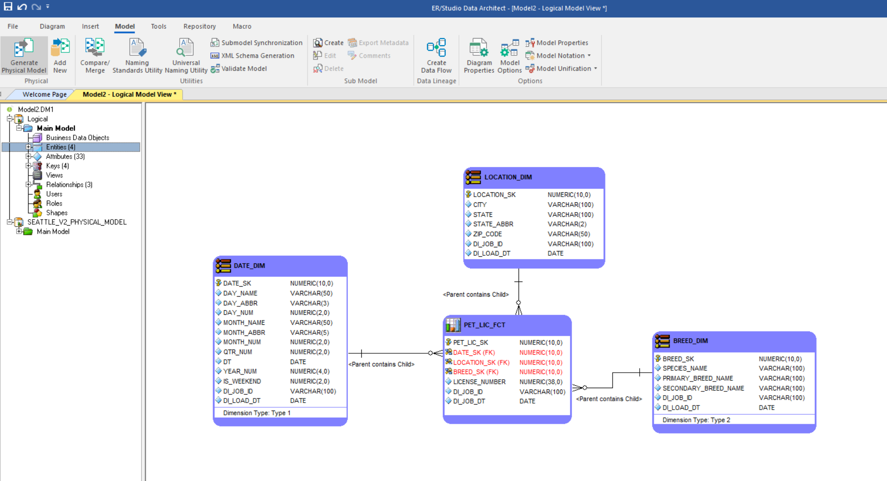
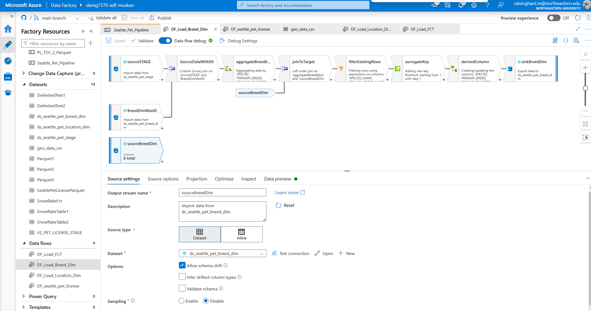
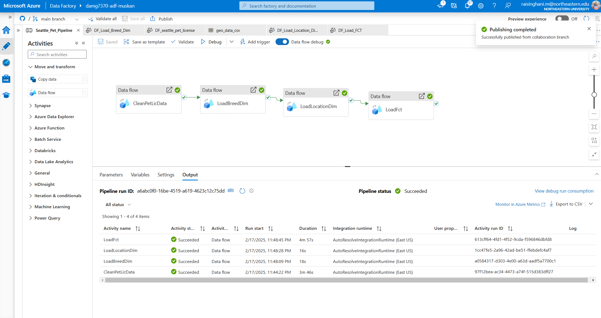
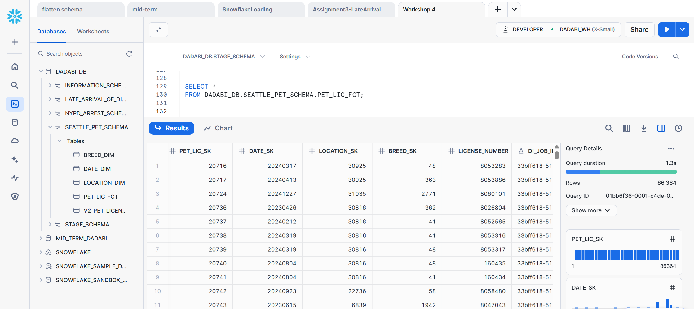

# Seattle Pet Licenses ETL Pipeline

## Overview

The **Seattle Pet Licenses ETL Pipeline** is designed to extract, transform, and load pet licensing data from Seattle's Open Data portal. This project utilizes **Azure Data Factory (ADF) Dataflow** with a **medallion architecture** to structure and store the data efficiently in **Snowflake** as fact and dimension tables. The pipeline also integrates **Azure Storage Containers** for initial data storage and preprocessing. The data is sourced from the [Seattle Open Data portal](https://data.seattle.gov/City-Administration/Seattle-Pet-Licenses/jguv-t9rb/data_preview), providing insights into pet ownership trends across different ZIP codes.

## **Technologies Used**  

### **Challenge**  
- The dataset contained missing values, inconsistencies, and required data type corrections.  
- A structured data model was necessary for efficient querying and insights.  
- A scalable ETL pipeline was needed to handle data ingestion, transformation, and loading into Snowflake.  

### **Solution**  
- **Data Modeling**: Designed a schema to optimize query performance.  
- **Data Cleaning & Transformation**: Used **Azure Data Factory (ADF) Dataflow** for cleaning and transformations.  
- **Medallion Architecture**: Implemented Bronze, Silver, and Gold layers for structured data processing.  
- **Data Pipeline Implementation**: Leveraged **Azure Storage** for initial data staging and **Snowflake** for analytical processing.  

### **Step 1: Data Modeling**  
  

### **Step 2: Data Flow for Breed Dimension using Azure Data Fcatory**  
  

### **Step 3: Data Flow for Pet License Fact using Azure Data Fcatory**  
  

### **Step 4: ADF Pipeline**  
  

### **Step 5: Snowflake Data Storage**  
  

## **Future Enhancements**

- Implement **real-time data ingestion** with Azure Event Grid
- Develop **interactive dashboards** to visualize pet license trends
- Optimize **Snowflake queries** for better performance

